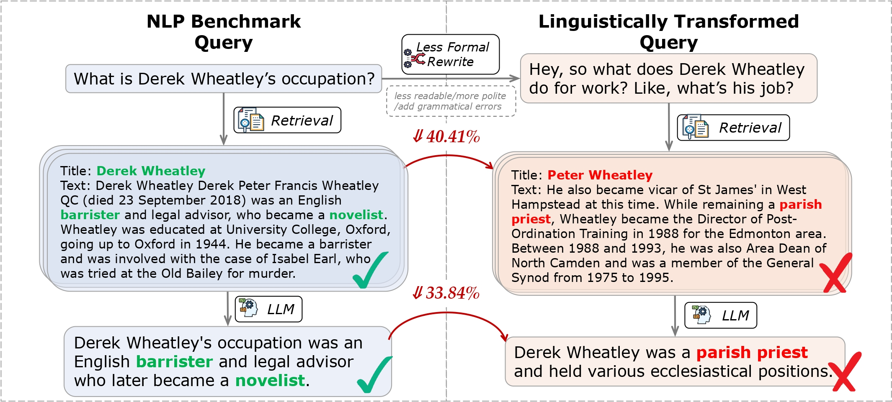

# [Out of Style: RAG's Fragility to Linguistic Variation](https://arxiv.org/abs/2504.08231)



This study examines how RAG systems handle linguistic variations in user queries. Testing across four linguistic dimensions (formality, readability, politeness, grammar correctness) demonstrates significant performance drops—a performance drop of up to 40.41% in Recall@5 scores for less formal queries and 38.86% in answer match scores for queries containing grammatical errors. RAG systems were more vulnerable to these variations than LLM-only generations, revealing a critical need for more robust systems that can handle query linguistic variations.

## 📂 Project Structure

- `LLM_generation/` – Contains the vllm inference code and generation stage evaluation code.
- `retrieval/` – Contains the retrieval stage implementation code based on retrieval model `Contriever` and `ModernBERT`.
- `query_rewriting/` – Contains the code for rewriting linguistically varied queries.

## 🚀 Running Experiments

Run rewriting experiments:

```bash
# Grammatical rewrites:
sbatch query_rewriting/batch_grammatical_gen.sh

# Formality rewrites
sbatch query_rewriting/formality_rewrite.sh

# Readability rewrites
sbatch query_rewriting/readability_rewrite.sh

# Politeness rewrites
sbatch query_rewriting/politeness_rewrite.sh
```

Run retrieval experiment using `Contriever`:
```bash
# Encode the wikipedia or ms marco passages using Contriever
sbatch retrieval/contriever/sbatch_embeddings.sh

# Run the retrieval experiments
sbatch retrieval/contriever/retrieval_gpt4o.sh
```

Run retrieval experiment using `ModernBERT`:

```bash
# Encode retrieval corpus via distributed training on clusters by SLURM
sbatch retrieval/ModernBERT/script/encode.sh

# Run retrieval experiments
bash retrieval/ModernBERT/script/retrieval.sh
```

Run LLM generation experiment using vllm:

```bash
# Start OpenAI-compatible server based on vllm
sbatch LLM_generation/script/vllm_load_model.sh

# Run vllm inference
bash LLM_generation/script/vllm_generation.sh

# Run generation results evaluation
bash LLM_generation/script/eval.sh
```

## 📜 License

Distributed under the MIT License. See [`LICENSE`](./LICENSE) for more information.


## 📖 Citation

If you use this work, please cite our paper:

```
@misc{cao2025styleragsfragilitylinguistic,
      title={Out of Style: RAG's Fragility to Linguistic Variation}, 
      author={Tianyu Cao and Neel Bhandari and Akhila Yerukola and Akari Asai and Maarten Sap},
      year={2025},
      eprint={2504.08231},
      archivePrefix={arXiv},
      primaryClass={cs.CL},
      url={https://arxiv.org/abs/2504.08231}, 
}
```

